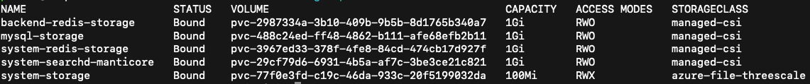
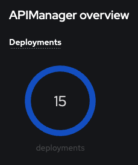
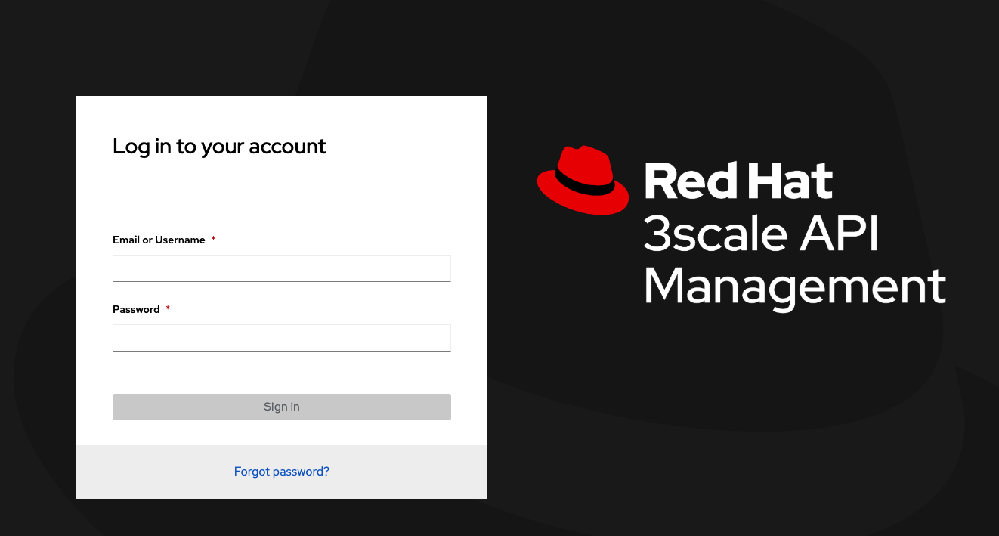

# Basic 3scale Installation on Azure

Configuration tested:
- ARO 4.15
- 3scale API Management 2.15
- Internal databases


## 1. Setup access to pull images
The operator needs access to pull images from registry.redhat.io.

Create a new service account here: https://access.redhat.com/terms-based-registry/#/accounts

```
  It has a username: 1234567|arosharedcluster and a password a-bunch-of-letters-numbers-and-symbols-i-cant-share-with-you
```

Now create a secret to hold those.

``oc create secret docker-registry threescale-registry-auth --docker-server=registry.redhat.io \
    --docker-username="1234567|arosharedcluster" \
    --docker-password="a-bunch-of-letters-numbers-and-symbols-i-cant-share-with-you"''

## 2. Install the 3scale Operator
Install "3scale - Red Hat Integration" version 2.15 operator through OperatorHub in the OpenShift webconsole. Install it with options: in your project namespace and using an Automatic approval strategy.

Now try oc get subs again and you should see something like:
```NAME              PACKAGE           SOURCE             CHANNEL
  3scale-operator   3scale-operator   redhat-operators   threescale-2.15
```

## 3. Setup access to provision storage

### Setup the roles necessary for Azure Files
We need to give the service account that binds storage additional access so it can create an Azure access secret in our projects. By default ARO doesn't (currently) pre-configure this access, so create below resource to configure that (you can oc create -f the file in this repo):

```
   oc create -f clusterrole.yaml
   oc adm policy add-cluster-role-to-user system:azure-cloud-provider-secrets system:serviceaccount:kube-system:persistent-volume-binder
```

### Setup a new RWX Storage class for 3scale to use
3scale needs RWX persistent volumes. In Azure we can use Azure Files with Premium class for this by creating a new storage class. We also will need to scope the storage class specifically to the project where 3scale will run (due to a known limitation with how Azure Files mounts to Linux).

Get your project's uid with: 

```
  oc describe project YOUR_PROJECT_NAME | grep uid-range
```

You should see something like (note the first number is our uid): openshift.io/sa.scc.uid-range=1000740000/10000

Now we can create a storage class using that. Replace the uid in the yaml below with that uid you just got. Also, replace the name if you want to call it something more specific (like your actual project namespace name).

```
oc create -f storageclass.yaml
```

## Install 3scale
We will create an APIManager custom resource which the operator will see and then do an installation for us. Note we set the FileStorageSpec to PVC in the template for the API Manager to match the StorageClass name we created earlier.

Also, in the below config (apimanager.yaml) update the wildcardDomain to match your OpenShift apps domain, check the namespace and storageClassName match what you just created, then oc create -f the file.

```
oc create -f apimanager.yaml
```

Now wait about 5 min for everything to come up. While you wait, check oc get pvc to make sure they all eventually create and goto a BOUND state. And also you can oc get pods -w to watch the pods go ready.

```
oc get pvc
```





## Login

Get your login info with:

```
oc get secret system-seed -o json | jq -r .data.ADMIN_USER | base64 --decode
oc get secret system-seed -o json | jq -r .data.ADMIN_PASSWORD | base64 --decode
```

Find your URL with:

```
oc get routes | grep admin
```

You see the second column has the URL. You're up and running and it looks like this:

